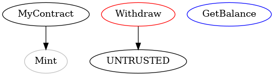

# How To Visibilize Your Smart Contract Using Solgraph.....

## What Is Solgraph ?
- Solgraph is a tool used for visualizing the control flow of Solidity smart contracts. It can be helpful for analyzing the security of smart contracts by providing a visual representation of the control flow within the contract's code. This can assist in identifying potential vulnerabilities and understanding the overall structure of the contract.

***Legend:***
   * Red: Send to external address
   * Blue: Constant function
   * Yellow: View
   * Green: Pure
   * Orange: Call
   * Purple: Transfer
   * Lilac: Payable
## How To Install Solgraph ?
***Optional Step***


```
mkdir solgraph 
```
```
cd solgraph
```
***Mandatory Step***
```
sudo su
```

```
touch MyContract.sol
```
```
nano MyContract.sol
```
***This is the contant of a MyContract.sol file***

```
touch MyContract.dot
```
```
touch MyContract.dot
```
***This is the contant of a MyContract.dot file***


```
sudo apt install npm
```

```
npm install -g solgraph
```
Depending on your permissions, you may need to add the unsafe-perm flag:

```
sudo npm install -g solgraph --unsafe-perm=true --allow-root
```
You have to have graphviz installed to render the DOT file as an image:

```
apt install graphviz
```

```
dot -Tpng MyContract.dot -o MyContract.png
```

[For More Information Go Through..](https://github.com/raineorshine/solgraph)