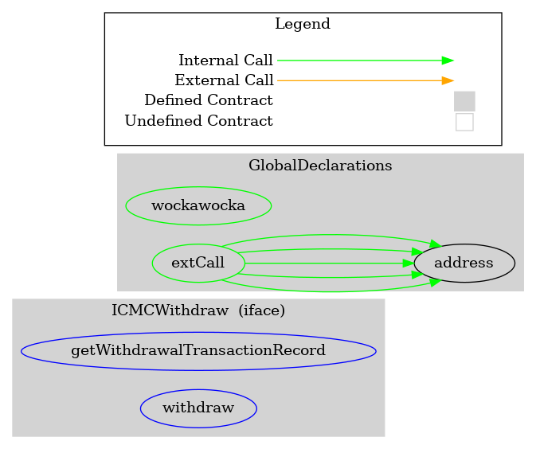
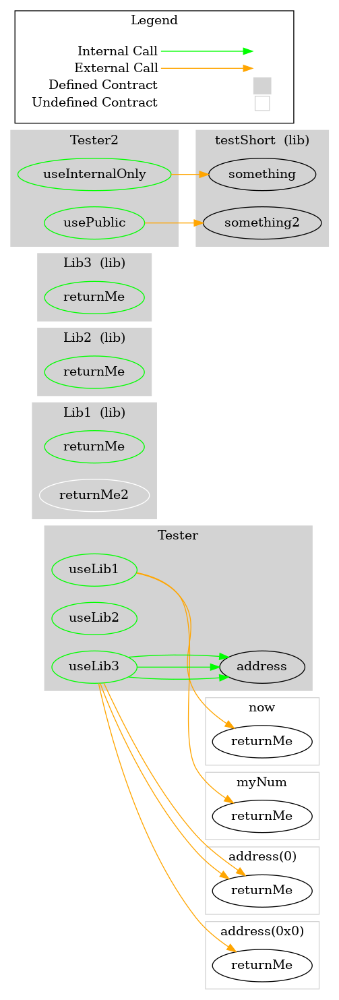
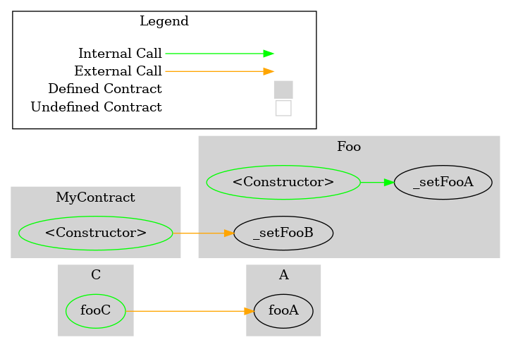
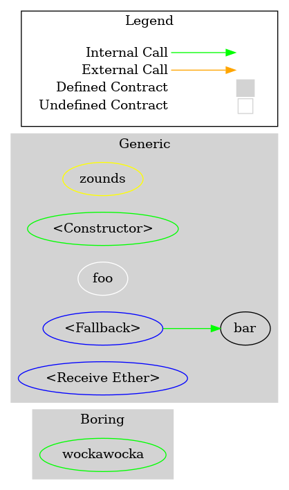
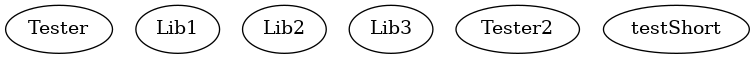
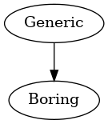
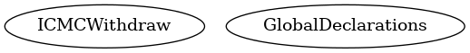
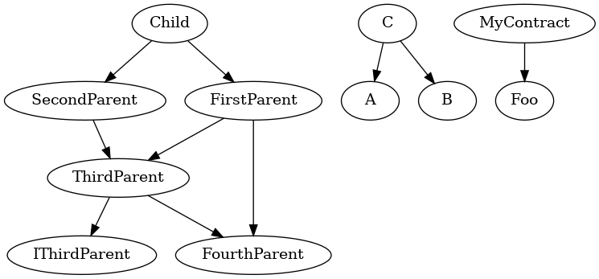

# How To Use Surya For Auditing Smart Contracts.....

## What Is Surya ?
- Surya is a specific blockchain auditing tool.

## How To Install Surya ?
***Optional Step***


```
mkdir surya && cd surya 
```

***Mandatory Step***
```
sudo su
```

```
npm install -g surya
```


```
surya graph Contracts/Library.sol | dot -Tpng > Library.png
```
***Output***
+ ***Library***


+ ***Generic***


+ ***Global***


+ ***Inheritance***


+ ***V060***




## Flatten
- The flatten command outputs a flattened version of the source code, with all import statements replaced by the corresponding source code. Import statements that reference a file that has already been imported, will simply be commented out.


```
surya flatten Contracts/Library.sol
```


## Describe
- The describe command shows a summary of the contracts and methods in the files provided.


```
surya describe Contracts/Library.sol
```


## Inheritance
- The inheritance command outputs a DOT-formatted graph of the inheritance tree. For Windows machines, the > should be replaced with -o.


```
surya inheritance Contracts/Library.sol | dot -Tpng > Library1.png
```
***Output***
+ ***Library***


+ ***Generic***


+ ***Global***


+ ***Inheritance***


+ ***V060***


## Parse
- The parse command outputs a treefied AST object coming from the parser.


```
surya parse Contracts/Library.sol
```
***Output***


## Mdreport
- The mdreport command creates a Markdown description report with tables comprising information about the system's files, contracts and their functions. Much like describe but outputting to a nicely formatted Markdown file.
```
surya mdreport report_outfile.md Contracts/Library.sol
```
[Report File](report_outfile.md)

[For More Information Go Through..](https://github.com/Consensys/surya?tab=readme-ov-file)
